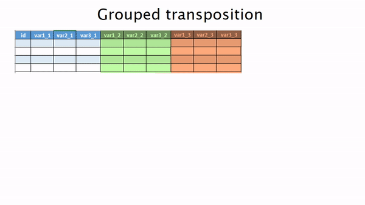

```{r setup, include=FALSE}
    # smaller: true
knitr::opts_chunk$set(echo = TRUE)
```

<style>
slides > slide {
  overflow-x: auto !important;
  overflow-y: auto !important;
}
</style>


## Load a couple libraries
```{r, message=F}
library(tidyverse)
library(glue) # similar to paste() but more powerful
```


## Create some fake visit data

Creating fake data is really helpful for creating a reproducible example (aka reprex)

```{r}
npats <- 100
nvisits <- 10
create_visit_df <- function(visit_number) {
  tibble(
    patid  = 1:npats,
    visitdate = lubridate::as_date(sample(0:1e4, 100)),
    blooddraw = rbinom(npats, 1, prob = .7),
    bloodrawwho_nurse = blooddraw*rbinom(npats, 1, prob = .7),
    bloodrawwho_other = blooddraw*(1-bloodrawwho_nurse)
  ) %>% 
    rename_at(vars(-patid), ~paste0(., "_", visit_number))
}

visit_wide <- map(1:nvisits, create_visit_df) %>% 
  reduce(inner_join, by = "patid")

```

## One row per patient with grouped columns

```{r, echo=F, out.width=20}
DT::datatable(visit_wide)
# visit_wide
```

## The goal: One row per visit
```{r, echo=F, out.width=2}
map(1:nvisits, ~select(visit_wide, patid, ends_with(glue("_{.}")))) %>% 
  map_dfr(~rename_all(., ~str_remove(., "_[:digit:]+$"))) %>% 
  arrange(patid) #%>% 
  # DT::datatable()

```

## Visually...

```{r, out.width = "1000px", echo=F}

```


## Lists

In computer science, a list or sequence is an abstract data type that represents a countable number of ordered values, where the same value may occur more than once.

https://en.wikipedia.org/wiki/List_(abstract_data_type)

## Lists can contain anything

```{r}

random_stuff <- list(mtcars,
                     qplot(mpg, cyl, data = mtcars), 
                     function(x) x^2, 
                     list("a", "b", "c"))
str(random_stuff, max.level = 1)
```

More complex objects in R are often just lists.

## Lists that contain objects of one type are especially useful

```{r}
list(1:3, 4:10, seq(0, 20, by = 2))
```


## Apply a function to each element of a list

Put the output of the element in a new list

```{r}
numeric_list <- list(1:3, 4:10, seq(0, 20, by = 2))

map(numeric_list, sum)

```

## Apply a custom function

```{r}
numeric_list <- list(1:3, 4:10, seq(0, 20, by = 2))

L2norm <- function(x) sqrt(sum(x^2))

map(numeric_list, L2norm)

```


## Create a custom function on the fly

Also called an anonymous function since it has no name

```{r}
numeric_list <- list(1:3, 4:10, seq(0, 20, by = 2))

map(numeric_list, function(x) sqrt(sum(x^2)))

```

## Use the ~ . shortcut to create a custom function on the fly

This shortcut only works in the tidyverse

```{r}
numeric_list <- list(1:3, 4:10, seq(0, 20, by = 2))

map(numeric_list, ~sqrt(sum(.^2)))

```

## Reduce a list to a single value

Use a function that takes two arguments and returns one value to reduce a list.

`+` is such a function 

```{r}
numeric_list <- list(1:3, 4:10, seq(0, 20, by = 2))

map(numeric_list, ~sqrt(sum(.^2))) %>% 
  reduce(`+`)

```


## Another example using glue for string concatenation

Anything inside {} is evaluated as code

```{r}
map(1:3, ~glue("_{.}")) %>% 
  reduce(c)
```


## Variants of map will do the reduce step for us

`map_chr` returns a character vector.

There are many other variants of the map function.

```{r}
map_chr(1:3, ~glue("_{.}")) 
```


## And just for the fun of it...


```{r, out.width = "1000px", echo=F}
# 

```

## Ok.. Back to the problem at hand

We can easily select all variables for one visit

```{r}
select(visit_wide, patid, ends_with("_1"))
```


## Split the dataframe into a list of dataframes

```{r}


df_list <- map(1:nvisits, ~select(visit_wide, patid, ends_with(glue("_{.}"))))

str(df_list, max.level = 1)
```

## The first visit

```{r}
df_list[[1]]
```

## The second visit

```{r}
df_list[[2]]
```

## We need to rename the columns

```{r}
df_list2 <- map(df_list, ~rename_all(., ~str_remove(., "_[:digit:]+$")))

map(df_list2, names)
```

## Finally we reduce using bind_rows

bind_rows takes two dataframes and rowbinds them
reducing the list with bindrows will iteratively apply bind_rows so we end up with one dataframe

```{r}
reduce(df_list2, bind_rows)
```

## Using the pipe %>% we can do all this three lines

```{r}
map(1:nvisits, ~select(visit_wide, patid, ends_with(glue("_{.}")))) %>% 
  map(~rename_all(., ~str_remove(., "_.$"))) %>% 
  reduce(bind_rows)

```


## Using one of the map variants we can do it in two lines

```{r}
map(1:nvisits, ~select(visit_wide, patid, ends_with(glue("_{.}")))) %>% 
  map_dfr(~rename_all(., ~str_remove(., "_[:digit:]+$"))) 

```


## It even works with a database

Create a SQLite database in memory and load our visit data into it
```{r}
library(DBI)
con <- dbConnect(RSQLite::SQLite(), ":memory:")
dbWriteTable(con, "visit_wide", visit_wide)
visit_db <- tbl(con, "visit_wide")
```


## R writes the SQL for us and sends it to the database

We just change bind_rows to union_all


```{r}
map(1:nvisits, ~select(visit_db, patid, ends_with(glue("_{.}")))) %>% 
  map(~rename_all(., ~str_remove(., "_[:digit:]+$"))) %>% 
  reduce(union_all)
```

## map saved us from having to write a lot of SQL

```{r}

map(1:nvisits, ~select(visit_db, patid, ends_with(glue("_{.}")))) %>% 
  map(~rename_all(., ~str_remove(., "_[:digit:]+$"))) %>% 
  reduce(union_all) %>% 
  show_query()
```

## The takeaway

The map and reduce functions allow us to program on a higher level of abstraction.

The scoped variants of dplyr work much the same way.

```{r, eval = F}
mutate_if(); mutate_at(); mutate_all()
select_if(); select_at(); select_all()
filter_if(); filter_at(); filter_all()
rename_if(); rename_at(); rename_all()
summarise_if(); summarise_at(); summarise_all()
```

These functions map over a dataframe which is a list of columns.

```{r}
is.list(mtcars)
```


```{r, include=F}
dbDisconnect(con)
```

